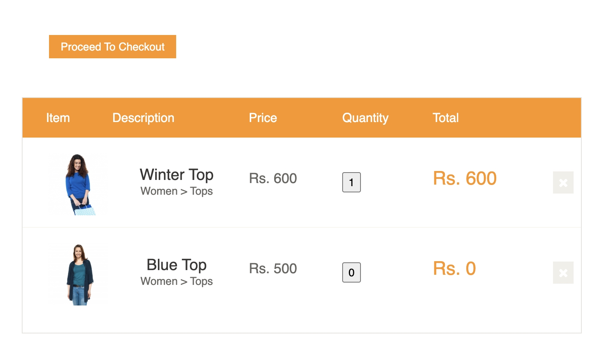

# Bug Reports

Bug reports written in the format I would use in a real QA role. All of these are genuine findings from manual exploration of [automationexercise.com](https://automationexercise.com) during the build of this test framework.

Included in the portfolio because automation repos rarely show the manual QA craft that sits alongside the automation: observing, isolating, and documenting defects clearly enough for a developer to act on without a follow-up conversation.

| ID | Summary | Severity |
|----|---------|----------|
| BUG-001 | Cart quantity field appears editable but does not accept input | Medium |
| BUG-002 | Product can be added to cart with quantity set to 0 | Medium |
| BUG-003 | Negative quantity accepted, producing a zero-quantity, zero-price cart line | High |

---

## BUG-001: Quantity field in cart appears editable but does not accept input

**Reported by:** Remi Jacobsson
**Date:** 2026-09-29
**Environment:** Chrome 128 on macOS 14.5, viewport 1440x900
**Build / URL:** https://automationexercise.com (production)

### Summary

On the cart page, the "Quantity" field for each item is rendered as an input element and visually appears editable (cursor changes, field accepts focus), but any attempt to change the value is silently discarded. Users have no way to adjust the quantity of an item already in the cart.

### Severity: Medium

Not a blocker (the user can work around it by removing the item and re-adding it from the product page), but misleading UI costs user trust and increases abandonment risk on checkout. For an e-commerce site, friction in the cart is directly tied to revenue.

### Priority: Medium

Visible on every cart interaction. Should be fixed in the next cart-related release.

### Steps to Reproduce

1. Navigate to https://automationexercise.com/products
2. Click "Add to cart" on any product
3. Click "Continue Shopping" on the confirmation modal
4. Click the "Cart" link in the top navigation
5. In the Quantity column for the added item, click into the quantity field
6. Attempt to change the value (e.g. type "3" or use arrow keys)
7. Click elsewhere on the page or press Tab to blur the field

### Expected Result

The quantity updates to the new value. The line total (price × quantity) recalculates accordingly.

### Actual Result

The field accepts focus and appears editable, but the entered value is discarded on blur. The displayed quantity reverts to its original value. The line total does not update. No error message or feedback is shown to the user.

### Evidence

- Confirmed in Chrome, Firefox, and Safari (WebKit)
- Confirmed with keyboard entry and up/down arrow buttons
- Field has `name="quantity"` and `type="button"` in the DOM, suggesting it is styled as an input but not wired to a change handler
- Screenshot: [no screenshot captured for this report]

### Suggested Fix

Either:
- Wire the quantity field to a change handler that updates the cart state and recalculates the line total, or
- Disable editing on the field and surface the limitation clearly (e.g. "To change quantity, remove and re-add the item"), so users are not misled by an input that does not function.

The first option is the better user experience and matches typical e-commerce conventions.

### Additional Notes

Discovered during exploratory testing while building automated coverage for cart behaviour. The test suite was adapted to assert on the correct line-total calculation when the same item is added multiple times (via the "Add to cart" flow), since that is the only way users can actually increase quantity on this site.
---

## BUG-002: Product can be added to cart with quantity set to 0

**Reported by:** Remi Jacobsson
**Date:** 2026-10-10
**Environment:** Chrome 128 on macOS 14.5, viewport 1440x900
**Build / URL:** https://automationexercise.com/product_details/5 (production)

### Summary

On the product details page, the quantity field accepts a value of 0 and allows the item to be added to the cart. No validation message is shown. The item is silently added with a quantity of 1, meaning invalid input is coerced rather than rejected.

The quantity input declares `min="1"` in the HTML, but this constraint is not enforced before submission.

### Severity: Medium

The user is not blocked, and the coerced quantity of 1 means no incorrect order value reaches checkout. However, silently changing a user's input without feedback is a trust and usability issue: the user believes they added 0 and receives 1. In an e-commerce context, any silent alteration of basket contents risks disputes and abandoned checkouts.

### Priority: Medium

Reproducible on every product page. Should be addressed alongside BUG-003, which shares the same root cause.

### Steps to Reproduce

1. Navigate to https://automationexercise.com/product_details/5
2. Clear the Quantity field and enter `0`
3. Click "Add to cart"
4. On the confirmation modal, click "View Cart"
5. Observe the Quantity and Total columns for the added item

### Expected Result

The application rejects the input, either by preventing submission or by displaying a validation message such as "Quantity must be at least 1". The item is not added to the cart.

### Actual Result

The confirmation modal appears as though the action succeeded. The item is added to the cart with a quantity of 1 and a line total of Rs. 600. No validation message is shown at any point.

### Evidence

- Quantity input in the DOM: `<input type="number" name="quantity" id="quantity" value="1" min="1">`
- The declared `min="1"` constraint is not enforced
- Reproduced in Chrome, Firefox, and WebKit
- Quantity set to 0 on the product details page:

- Cart after adding, showing the item present with quantity 1:

### Suggested Fix

Enforce the existing `min="1"` constraint before submission, and surface a clear validation message when the user enters a value below the minimum. Server-side validation should also reject out-of-range quantities, since client-side constraints can be bypassed.

---

## BUG-003: Negative quantity accepted, producing a zero-quantity, zero-price cart line

**Reported by:** Remi Jacobsson
**Date:** 2026-10-10
**Environment:** Chrome 128 on macOS 14.5, viewport 1440x900
**Build / URL:** https://automationexercise.com/product_details/5 (production)

### Summary

The quantity field accepts negative values. Entering `-1` and adding to cart creates a cart line with a quantity of 0 and a price of Rs. 0. Invalid input reaches the cart calculation rather than being rejected at the point of entry.

### Severity: High

Unlike BUG-002, this defect allows invalid data to propagate into the cart's calculation logic, producing a line item with no quantity and no value. In a real e-commerce system this risks order-processing errors, inventory discrepancies, and incorrect order totals. Any route by which a user can manipulate price or quantity through unvalidated input is a commercial and potentially security-relevant concern.

### Priority: High

Should be prioritised above BUG-002. Shares the same root cause (absent quantity validation) but with materially worse consequences.

### Steps to Reproduce

1. Navigate to https://automationexercise.com/product_details/5
2. Clear the Quantity field and enter `-1`
3. Click "Add to cart"
4. On the confirmation modal, click "View Cart"
5. Observe the Quantity and Total columns for the added item

### Expected Result

The application rejects the negative input, either by preventing submission or by displaying a validation message. The item is not added to the cart.

### Actual Result

The item is added to the cart with a quantity of 0 and a line total of Rs. 0. No validation message is shown.

### Evidence

- Quantity input in the DOM: `<input type="number" name="quantity" id="quantity" value="1" min="1">`
- The declared `min="1"` constraint is not enforced for negative values
- Reproduced in Chrome, Firefox, and WebKit
- Quantity set to -1 on the product details page:

- Cart after adding, showing quantity 0 and a line total of Rs. 0:

### Suggested Fix

Validate quantity input on both the client and the server. Reject any value below 1 before the add-to-cart request is processed. Server-side validation is essential here, as client-side constraints can be bypassed through developer tools or direct API calls.

### Related

Shares a root cause with BUG-002 (absent quantity validation). Reported separately because each has distinct reproduction steps, distinct expected results, and can be verified independently once fixed.
